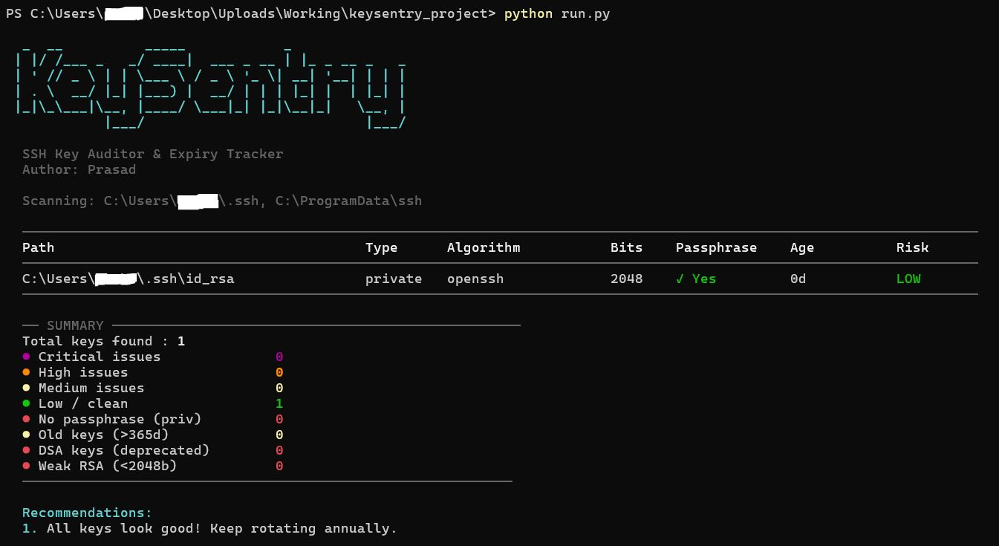

# KeySentry - SSH Key Auditor & Expiry Tracker

Scan your system for SSH keys, detect weak algorithms, unprotected private keys, and keys that are overdue for rotation.

**Zero external dependencies - pure python stdlib.**

# Output



---

## Features

- **Auto-discovers** SSH keys in `~/.ssh` and system paths
- **Passphrase detection** — flags unprotected private keys
- **Weak algorithm detection** — DSA, RSA < 2048 bits
- **Age tracking** — warns at 1 year, critical at 2 years
- **Fingerprints** — MD5 & SHA-256 for every key
- **Reports** — HTML, JSON, CSV export
- **Cross-platform** — Windows, Linux, macOS
- **Color output** — with risk levels

---

## Risk Levels

| Level | Meaning |
|---|---|
| 🟢 LOW | Key is healthy |
| 🟡 MEDIUM | Old key, rotation recommended |
| 🟠 HIGH | Weak algorithm or no passphrase |
| 🔴 CRITICAL | DSA key, critically small RSA, or multiple issues |

---

## Quick Start

```bash
git clone https://github.com/Laxdip/keysentry.git
cd keysentry
python run.py --path ~/.ssh --export report.html
```
---

## Usage

```
python run.py [OPTIONS]

Options:
  --path, -p DIR      Path to scan (default: ~/.ssh)
  --recursive, -r     Recurse into subdirectories
  --format, -f FORMAT table | json | csv
  --export, -e FILE   Export to .html/.json/.csv
  --risk LEVEL        LOW | MEDIUM | HIGH | CRITICAL
  --no-summary        Skip summary panel
  --version           Show version
  --help              Show help
```

---

## What Gets Checked

CRITICAL(DSA, RSA<2048) | HIGH(no passphrase, age>2y) | MEDIUM(age>1y, RSA<4096 → migrate to Ed25519)
---

## Running Tests

```bash
python tests/test_keysentry.py
```

> No pytest needed - runs with pure stdlib.

---

## Requirements

- Python 3.8+
- No external packages
- `ssh-keygen` (optional — used to extract private key bit sizes when available)

---

## Author

Prasad

## License

MIT
